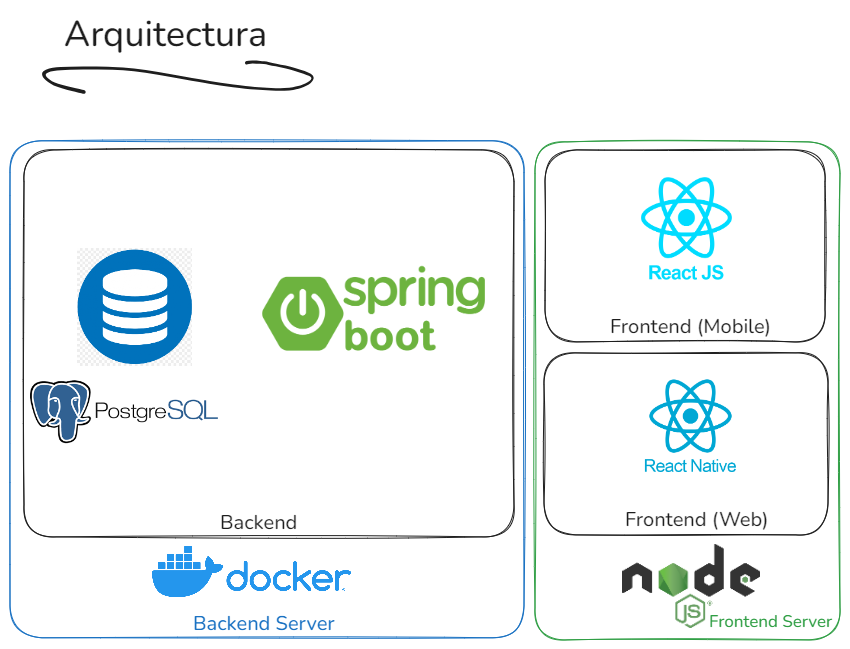

**Taller de desarrollo de Software -- Grupo F**
# Syntax Flavor

**Equipo:**

- Oscar Campohermoso - oscar.campohermoso@ucb.edu.bo
- Miguel Carrasco - miguel.carrasco@ucb.edu.bo
- Fabiola Martínez - fabiola.martinez@ucb.edu.bo
- Diana Montero - diana.montero.g@ucb.edu.bo
- Gabriela Zizold - gabriela.zizold@ucb.edu.bo

## 1. User Story Map

El mapa de historias de usuario se desarrolló en Lucidspark, se encuentra abierto en el siguiente enlace

https://lucid.app/lucidspark/a40db70a-3a69-45b3-9235-257e8f4f6a86/edit?viewport_loc=-550%2C164%2C1893%2C1021%2C0_0&invitationId=inv_d21f3a9e-d47f-4b5c-bd5e-3c5ff687a63c

## 2. Descripción del producto

SyntaxFlavor se trata de una aplicación para la gestión automática de pedidos en restaurante. Consta de una plataforma web y una móvil. En la aplicación móvil el comensal podrá registrarse con su usuario, escaneará un QR con el cuál el sistema registrará su mesa y abrirá el menú con los productos disponibles. Desde allí el cliente realizará y pagará su orden; esta será enviada inmediatamente a cocina.

Desde el portal web podrán acceder cocina y administración. Cocina tendrá una cola de pedidos con las mesas asignadas, a medida que vayan asignando pedidos cocina puede despacharlos y marcarlos como completos. Por otra parte, la vista de adminsitrador podrá solicitar resúmenes de platos más solicitados, totales de ventas y otra información relevante.

## 3. Tablero Jira

https://ucb-team-tdds-grupof.atlassian.net/jira/software/projects/SCRUM/boards/1

## 4. Diagrama de la arquitectura

## 5. Repositorios

1. Backend: https://github.com/GrupoF-SyntaxFlavor/SyntaxFlavor_Backend

2. Frontend Web: https://github.com/GrupoF-SyntaxFlavor/SyntaxFlavor_FrontendWeb

3. Frontend Mobile:  https://github.com/GrupoF-SyntaxFlavor/SyntaxFlavor_FrontendMobile

## 6. Diagramas Relevantes

1. Entidad-Relación: https://my.vertabelo.com/model/gEzzW8PRr2IFnrxRZoPFrKztmwJEBSUw
2. Mockups: https://balsamiq.cloud/slo1qxs/pa8sj31/r2278
