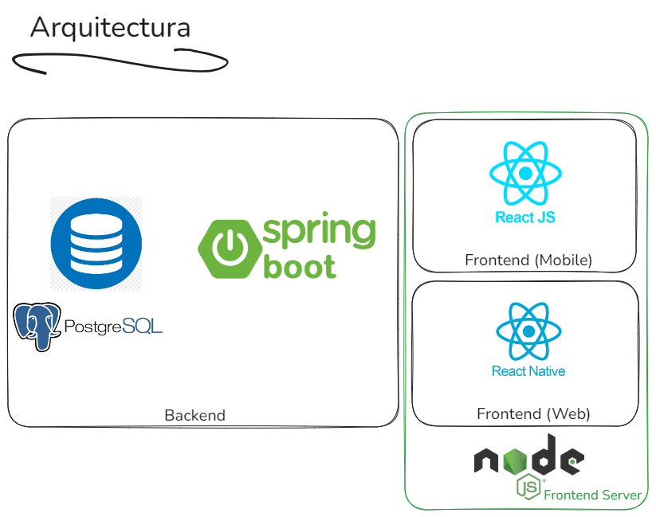

**Taller de desarrollo de Software -- Grupo F**
# Syntax Flavor
-----

## 1. User Story Map

El mapa de historias de usuario se desarrolló en Lucidspark, se encuentra abierto en el siguiente enlace

https://lucid.app/lucidspark/a40db70a-3a69-45b3-9235-257e8f4f6a86/edit?viewport_loc=-550%2C164%2C1893%2C1021%2C0_0&invitationId=inv_d21f3a9e-d47f-4b5c-bd5e-3c5ff687a63c

## 2. Descripción del producto

## 3. Tablero Jira

## 4. Diagrama de la arquitectura

## 5. Repositorios

1. Backend: https://github.com/GrupoF-SyntaxFlavor/SyntaxFlavor_Backend

2. Frontend Web: https://github.com/GrupoF-SyntaxFlavor/SyntaxFlavor_FrontendWeb

3. Frontend Mobile:  https://github.com/GrupoF-SyntaxFlavor/SyntaxFlavor_FrontendMobile